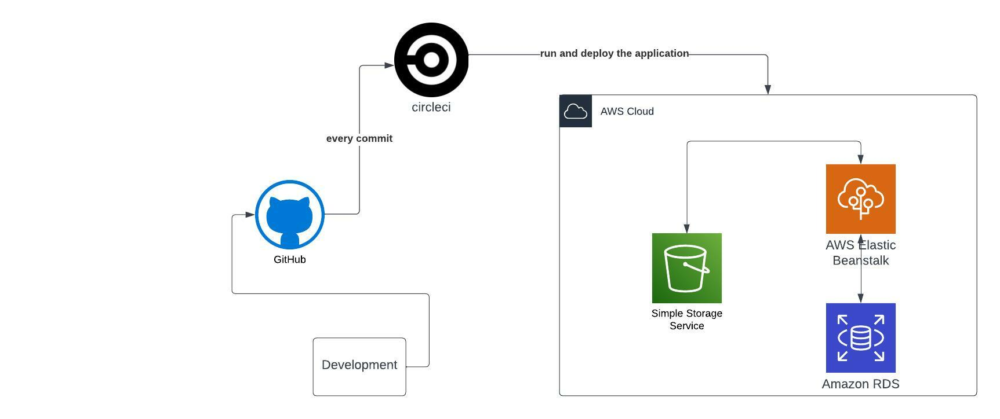

### Deployment Steps

## aws infrastucture diagram

## pipeline diagram

## RDS

## EB

![Image]https://github.com/Ahmed-Youssef-219/udagram/blob/main/udagram/images/EB/5_EB_sourceCodeOrigin.png?raw=true)

## S3

## Iam key

## Pipeline Process

